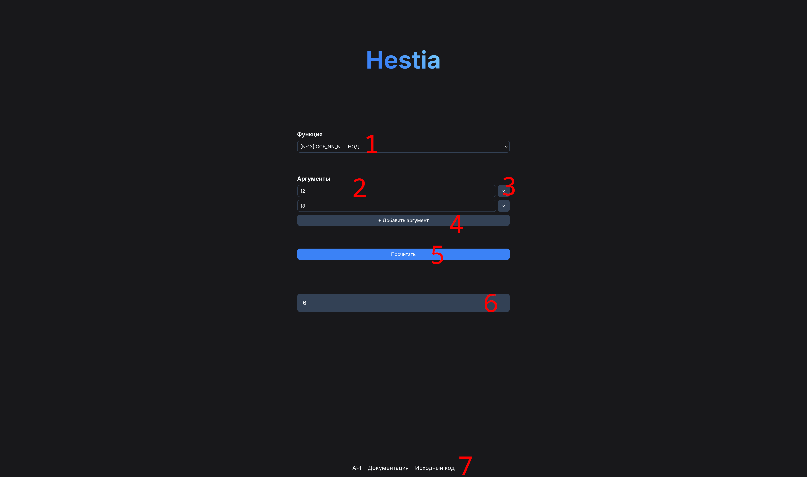

import { Steps } from "@astrojs/starlight/components"

## Интерфейс

1. Меню выбора функции
2. Поле ввода аргумента
3. Кнопка удаления аргумента. Нельзя удалить аргумент, если он один.
4. Кнопка добавления аргумента.
5. Кнопка вызова функции
6. Поле результата. Скрыто, пока функция не будет вызвана.
7. Полезные ссылки.

## Использование

<Steps>

1. Выберите функцию, которую хотите вызвать.
2. Задайте необходимое количество элементов, добавив недостающие или убрав лишние.
3. Введите аргументы.
4. Нажмите "Посчитать".
5. В поле результата появится результат или сообщение об ошибке.

</Steps>
